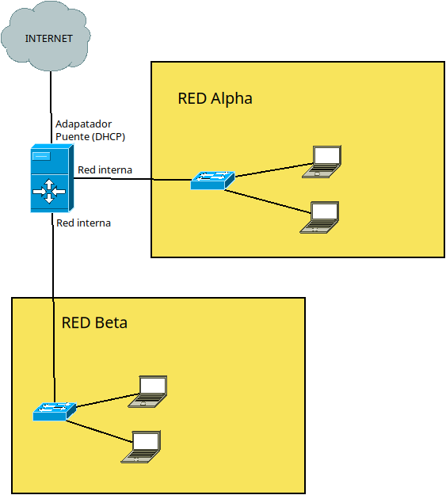

### Misión 1: **"El Enlace Vital. Episodio 1"**

En el mundo post-apocalíptico de "The Last of Us", los supervivientes se han agrupado en pequeñas zonas de cuarentena para protegerse y sobrevivir. El poblado en el que se os encontráis, conocido como **"Zona de Cuarentena Alpha"**, puede disponer de conexión a internet. Sin embargo, el poblado vecino, **"Zona de Cuarentena Beta"**, aunque tiene la infraestructura necesaria, no tiene a nadie capaz de realizar configuraciones efectivas. Para que la Zona de Cuarentena Alpha y Beta puedan conectarse a internet, debéis configurar un dispositivo en la para que funcione como router.

#### Instrucciones:

1. **Preparación de las Máquinas Virtuales:**
   - **Ubuntu Server (US):** Esta máquina funcionará como el enrutador. Debe tener un adaptador puente de red y un adaptador de red en red interna asociado a la red alpha y otro adaptador asociado a la red Beta.
   - **Ubuntu Desktop (Xubuntu):** Esta máquina se encontrerá en la Zona de Cuarentena Alpha y debe tener un adaptador en red interna.
   - **Ubuntu Desktop (Xubuntu):** Esta máquina se encontrerá en la Zona de Cuarentena Beta y debe tener un adaptador en red interna.

2. **Paso 1: Configuración de IP Estática**
   - **Ubuntu Server (US):** Configura la IP estática para cada adaptador de red interna modificando el archivo de netplan.
   - **Xubuntu Alpha:** Configura la IP estática del adaptador de red interna utilizando la interfaz gráfica.
   - **Xubuntu Beta:** Configura la IP estática del adaptador de red interna utilizando la interfaz gráfica.

   - **Verificación:** Comprueba la conectividad haciendo un ping entre ambas máquinas.

3. **Paso 2: Verificación del Adaptador Puente**
   - **Ubuntu Server (US):** Asegúrate de que el adaptador puente funciona correctamente. Haz un ping desde el servidor a la máquina anfitrión.

4. **Paso 3: Configuración del Enrutador**
   - **Tutorial:** Revisa el video tutorial proporcionado. https://youtu.be/fO-n3vbdBY8
   - **Modificación:** Modifica el parámetro indicado en el tutorial para que US funcione como enrutador.

5. **Paso 4: Comprobación del Funcionamiento**
   - **Xubuntu:** Desde las máquinas de Xubuntu, haz un ping a la IP de la interfaz del adaptador puente de la máquina US para comprobar que la configuración es correcta.

### Revisión del Concepto de NAT
6.  - **Paso 6. Video Tutorial:** Mira el video tutorial proporcionado y repasa el concepto de NAT (Network Address Translation). Este concepto es fundamental para permitir que múltiples dispositivos en la Zona de Cuarentena Beta accedan a internet a través del Enrutador Alpha.
   [Tutorial de NAT](https://youtu.be/sGdhakDeQyo)

7. **Paso 7. Configuración de DNS:**
   - **DNS Conselleria:** Configura los DNS en la interfaz de red de los equipos clientes en la Zona de Cuarentena Beta. Utiliza las siguientes direcciones DNS:
     - **Primario:** 10.239.3.7
     - **Secundario:** 10.239.3.8

8. **Paso 8. Configuración Persistente de NAT:**
   - **Persistencia:** Asegúrate de que la configuración de NAT quede de manera persistente en el Enrutador Alpha. Esto garantizará que la conexión a internet se mantenga estable y no se pierda tras un reinicio.
   - **Tutorial:** Sigue las instrucciones del tutorial anterior para configurar NAT de manera persistente: .

9. **Verificación del Funcionamiento:**
   - **Prueba de Conexión:** Desde un equipo cliente en la Zona de Cuarentena Alpha y otro de la zona de cuarentena Beta, realiza pruebas de navegación para asegurarte de que pueden acceder a internet correctamente.
   - **Ping:** Realiza un ping a una dirección externa (por ejemplo, 8.8.8.8) para verificar la conectividad.

AYUDA

