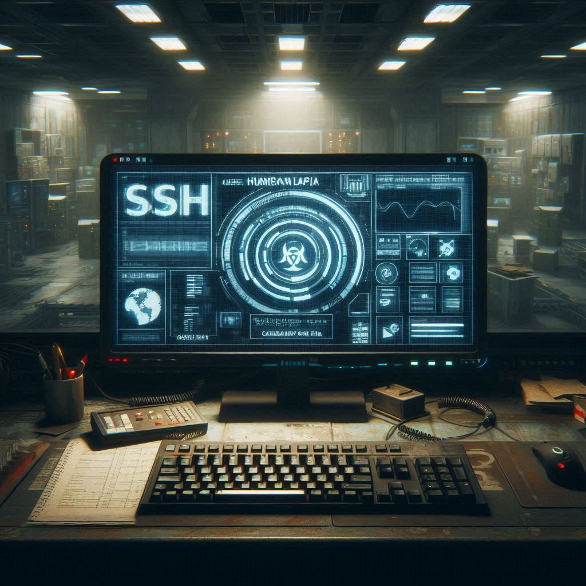

**Misión 2: La Amenaza Creciente**

En el mundo devastado de "The Last of Us", la humanidad lucha por sobrevivir en un entorno hostil y peligroso. Las zonas de cuarentena, como la **Zona de Cuarentena Alpha** y 
la **Zona de Cuarentena Beta**, se han convertido en refugios vitales para los supervivientes. 
Sin embargo, no todos los peligros provienen de los infectados; los piratas saqueadores, bandas de criminales despiadados, representan una amenaza constante.

**La Amenaza Creciente**

Recientemente, los piratas saqueadores han intensificado sus ataques. Han comenzado a interceptar las comunicaciones entre las zonas de cuarentena, 
robando información crucial y utilizando tácticas de guerra cibernética para desestabilizar a las comunidades. 
La **Zona de Cuarentena Alpha**, siendo una de las más avanzadas tecnológicamente, se ha convertido en un objetivo principal.

**La Misión: Asegurar las Comunicaciones**

Para protegerse de estos ataques, los líderes de la **Zona de Cuarentena Alpha** han decidido implementar medidas de seguridad avanzadas en sus comunicaciones. 
Han identificado la necesidad de configurar servidores OpenSSH que cumpla con los siguientes requisitos:

1. **El puerto por el que estará disponible SSH será el puerto 2022**:
   - Esto dificultará que los piratas identifiquen y ataquen el servidor SSH.

2. **No se permitirá el acceso al usuario root mediante SSH**:
   - Para evitar que los piratas obtengan acceso total al sistema en caso de comprometer una cuenta.

3. **Permitir solo usuarios específicos**  
   - Limita el acceo al usuario admin

4. **Deshabilitar el reenvío de X11**  

5. **Configurar el banner de advertencia**  
   - Añade una línea para mostrar un mensaje antes de iniciar sesión "Estas accediendo de manera segura"

**Resultado**

Gracias a estas medidas, las comunicaciones entre las zonas de cuarentena se volvieron mucho más seguras. Los piratas saqueadores encontraron cada vez más difícil interceptar y comprometer los mensajes. La **Zona de Cuarentena Alpha** y la **Zona de Cuarentena Beta** pudieron continuar colaborando y protegiéndose mutuamente en este mundo post-apocalíptico.