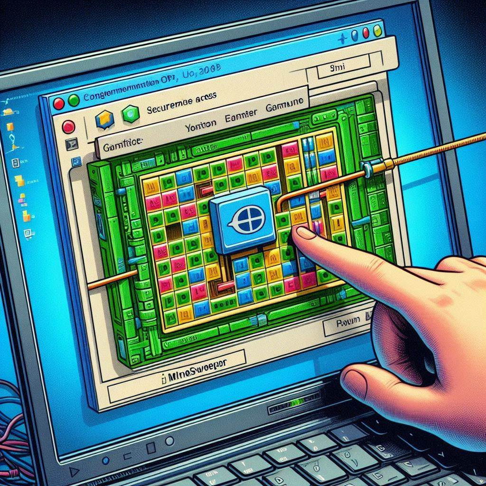

Parte 3. Configuración el servicio SSH para que permita ejecutar aplicaciones gráficas sobre el servidor. 

 
X1, es el servidor gráfico que usan casi todas las distribuciones Linux. Este servidor permite, forwarding a través de SSH. Esto significa que es posible ejecutar apliaciones gráficas de una máquina remota exportando el display a nuestro escritorio.  

La aplicación se ejecuta en el servidor remoto, pero la interfaz gráfica la visualizamos en nuestro escritorio local. 

 

Para la práctica instalar en la MV de ubuntu desktop  el juego de busca minas y posteriormente desde el equipo anfitrión conectaros con ssh y probar a abrir con este editor el archivo de configuración del ssh. 

¡Qué interesante práctica! Aquí tienes un enunciado para tu ejercicio universitario, ambientado en "The Last of Us":

---

### Episodio 2. Buscaminas

**Contexto:**

Las zonas de cuarentena son esenciales para mantener la seguridad y el control. En nuestro router de la zona alpha tenemos tres interfaces: una interfaz LAN para la zona de cuarentena Beta, una interfaz WAN, y otra interfaz LAN para la zona de cuarentena Alpha.

**Objetivo:**

El objetivo de esta práctica es configurar el acceso remoto seguro desde un equipo en la zona de cuarentena Beta a un equipo en la zona de cuarentena Alpha utilizando SSH. Además, se deberá acceder a un programa con interfaz gráfica (Buscaminas) que está disponible únicamente en un equipo de la zona Alpha.

**Justificación:**

1. **Seguridad y Control:** En un entorno de cuarentena, es crucial mantener la seguridad y el control de los recursos. Permitir el acceso remoto mediante SSH garantiza que las conexiones sean seguras y cifradas, protegiendo así la integridad de los datos y la infraestructura de la red.

2. **Acceso a Recursos Específicos:** El programa Buscaminas, que solo está disponible en un equipo de la zona Alpha, es necesario para ciertas tareas críticas. Permitir el acceso remoto desde la zona Beta a la Alpha facilita la utilización de este recurso sin necesidad de trasladar físicamente los equipos, lo cual podría comprometer la seguridad de las zonas de cuarentena.

3. **Eficiencia Operativa:** La capacidad de acceder remotamente a programas con interfaz gráfica desde diferentes zonas de cuarentena mejora la eficiencia operativa, permitiendo a los usuarios realizar sus tareas de manera más rápida y efectiva.

**Instrucciones:**

1. **Configuración de SSH:**
   - Configura el servidor SSH en el equipo de la zona Alpha.
   - Asegúrate de que el equipo de la zona Beta tenga un cliente SSH instalado.

2. **Acceso Remoto:**
   - Establece una conexión SSH desde el equipo de la zona Beta al equipo de la zona Alpha.
   - Verifica que la conexión sea segura y funcional.

3. **Acceso a la Interfaz Gráfica:**
   - Configura el reenvío X11 en la conexión SSH para permitir el acceso a la interfaz gráfica del programa Buscaminas.
   - Inicia el programa Buscaminas desde el equipo de la zona Beta y verifica que funcione correctamente.
