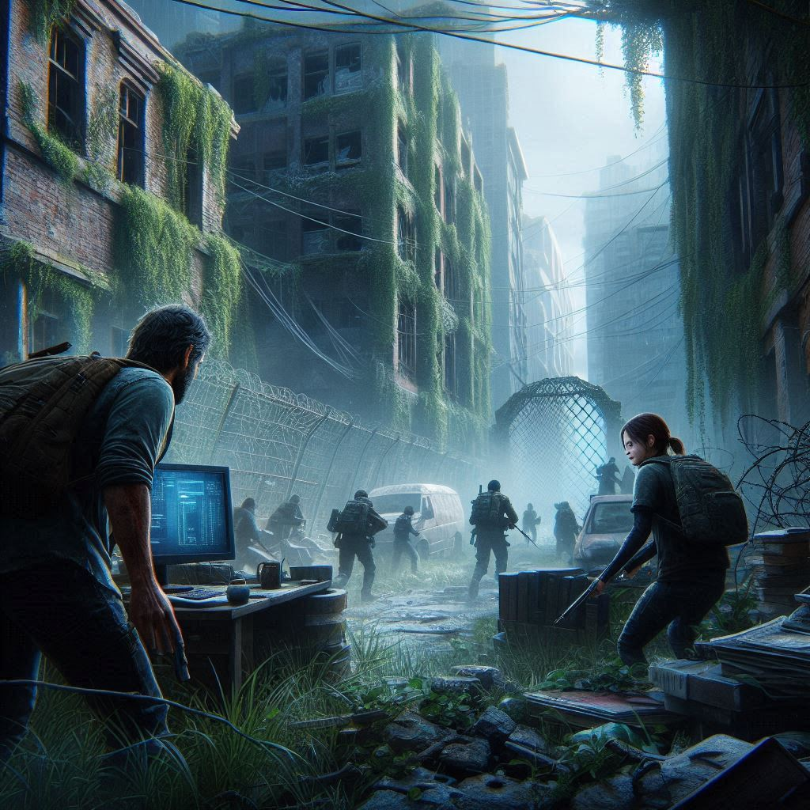

### Episodio 3: “Libertad Digital”

En la **Zona de Cuarentena Beta**, a la cual ayudasteis previamente, ha surgido un problema. Un sector de la zona está privando de libertad a sus compañeros, impidiéndoles navegar por ciertas páginas de internet, mediante un firewall. Desde la **Zona de Cuarentena Alpha**, queremos ayudar a nuestros amigos de la Zona Beta a superar esta restricción.

**Objetivo de la Misión:**

Configurar un túnel SSH desde la Zona de Cuarentena Beta hacia nuestro servidor en la Zona de Cuarentena Alpha, redirigiendo el tráfico de internet a través de este túnel para que los habitantes de la Zona Beta puedan navegar libremente.

En un mundo donde la libertad de información es crucial para la supervivencia, los héroes de la Zona de Cuarentena Alpha deben ayudar a sus vecinos de la Zona Beta a superar las restricciones impuestas. Con cada conexión segura establecida, no solo fortalecen la comunicación, sino que también promueven la libertad y la colaboración en un mundo devastado.
