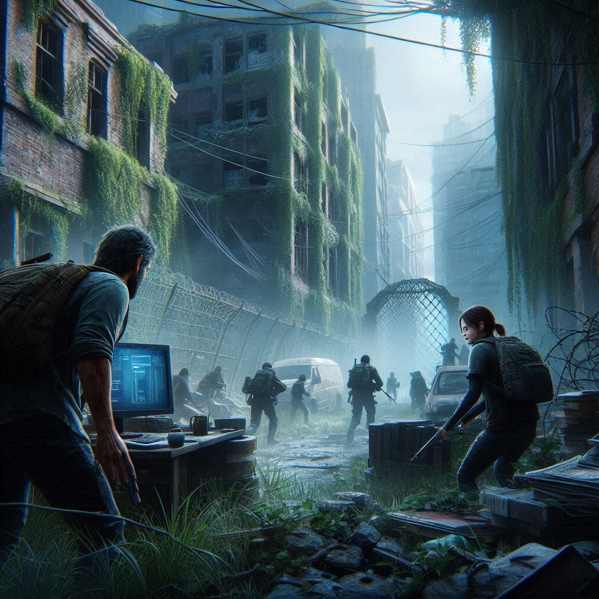

### Episodio 3: “Libertad Digital”

Han pasado varios años desde el brote. Alpha se ha convertido en uno de los pocos asentamientos relativamente seguros, pero las comunicaciones con el exterior son complicadas.

El grupo de exploradores ha conseguido poner en funcionamiento una máquina en AWS que tiene acceso a Internet. Sin embargo, los supervivientes que trabajan desde el asentamiento no pueden utilizar directamente esa conexión.

Tu misión consiste en establecer un túnel seguro hasta la máquina de AWS para que el tráfico generado por el navegador de tu equipo pueda salir a Internet a través de dicha máquina.

**Importante: en esta práctica no utilizarás máquinas virtuales ni GNS3. Todo el trabajo se realizará directamente desde la máquina anfitriona, utilizando su terminal y su navegador web.**

Dispones de:

* Una máquina anfitriona con conexión a Internet.

* Un navegador web instalado en dicha máquina.

* Un terminal.

* Una instancia Linux en AWS proporcionada por el profesor.

* Las credenciales necesarias para acceder a la instancia.

* La máquina AWS dispone de conexión a Internet.

Tu ordenador y la máquina AWS representan dos posiciones diferentes dentro del mapa de supervivientes:

