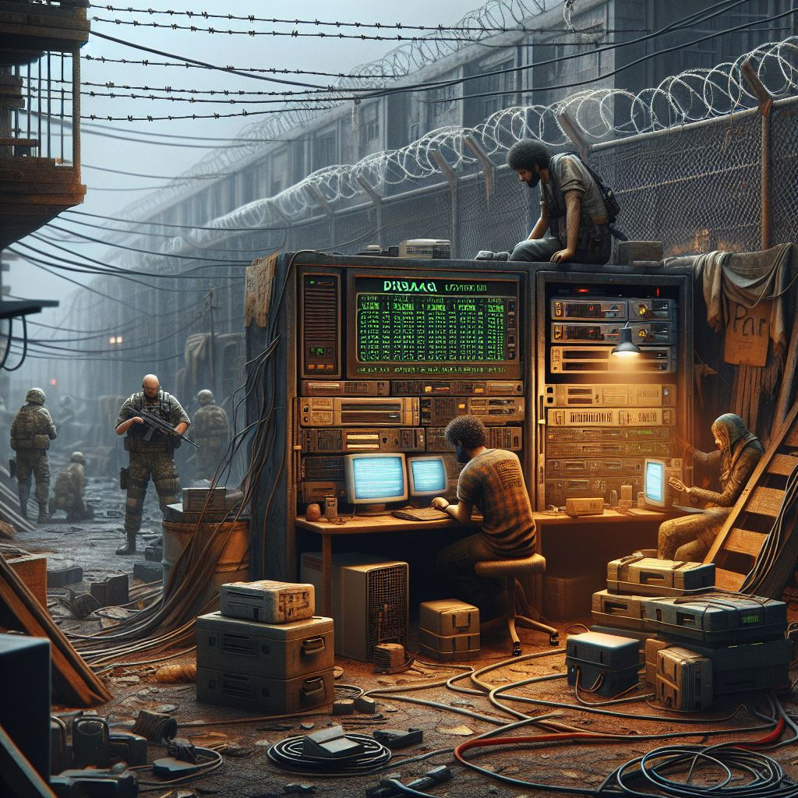

# Expansión de la red Alpha-Beta: Configuración de servicios esenciales para la supervivencia

---

### **Misión 1: Fortalecimiento de la Zona Alpha – Implementación de DNS y DHCP**

**Contexto:**

La Zona de Cuarentena Alpha ha crecido significativamente. Con cada nuevo superviviente que se une, los equipos conectados a la red aumentan, lo que ha comenzado a generar problemas de conectividad y administración. La asignación manual de direcciones IP y la falta de un sistema centralizado para resolver nombres de dispositivos están causando retrasos que ponen en peligro la coordinación dentro de la zona. Las comunicaciones vitales se ven comprometidas por el exceso de tráfico y la saturación de la red.

**Objetivo:**

Tu misión es configurar un servidor DNS y DHCP utilizando *DNSMASQ* en la Zona Alpha. Esto permitirá la asignación automática de direcciones IP y la resolución de nombres de forma eficiente, centralizando estos servicios y asegurando que la red de Alpha funcione sin interrupciones. Esta mejora en la infraestructura garantizará que las comunicaciones dentro de Alpha sean rápidas y seguras, permitiendo una mejor gestión de los dispositivos.

**Tareas a realizar:**

1. Instalar y configurar *DNSMASQ* en uno de los servidores de la Zona Alpha.
2. Configurar el servicio DHCP para que asigne automáticamente las direcciones IP a los dispositivos conectados.
3. Configurar el servicio DNS para resolver los nombres de los dispositivos en la red local. Queremos configurar únicamente dos equipos (VPCs) con los nombres "salva" y "guarda" ademas queremos que estos equipos siempre tengan la misma IP.
4. Configurar el servidor DNS para que si se le pregunta por la IP de salva o guarda responda su nombre. Realice la resolución inversa
5. Verificar que los dispositivos de Alpha puedan comunicarse sin conflictos de IP y con resolución de nombres funcional.

**Éxito de la misión:**  
La Zona Alpha contará con una red robusta, gestionada automáticamente mediante DNS y DHCP, lo que mejorará la coordinación entre los supervivientes.